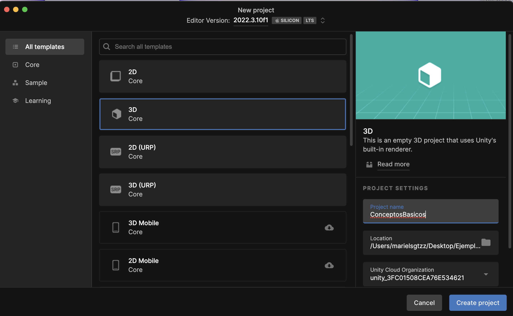
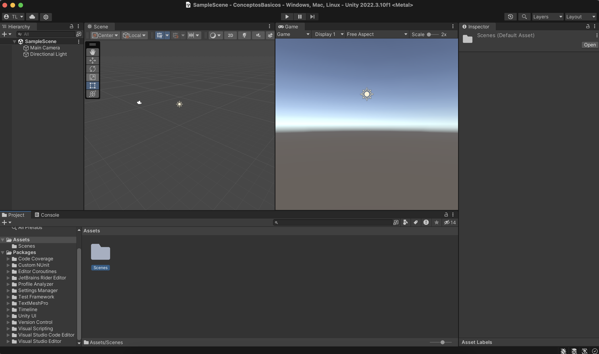
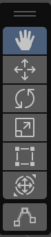
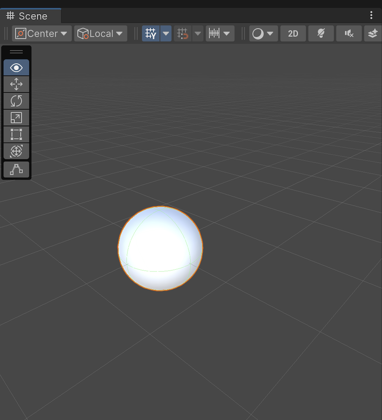
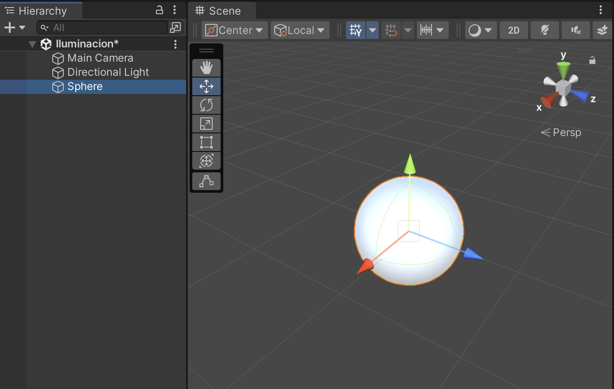
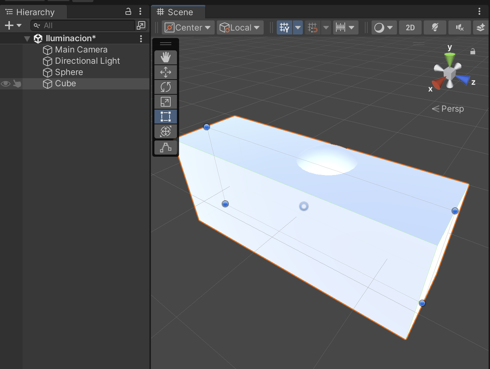
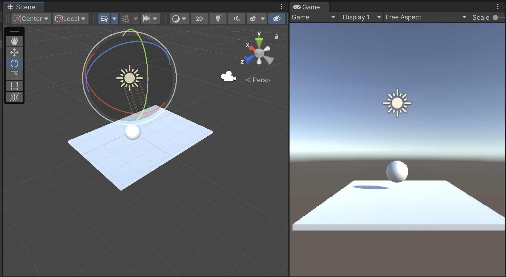
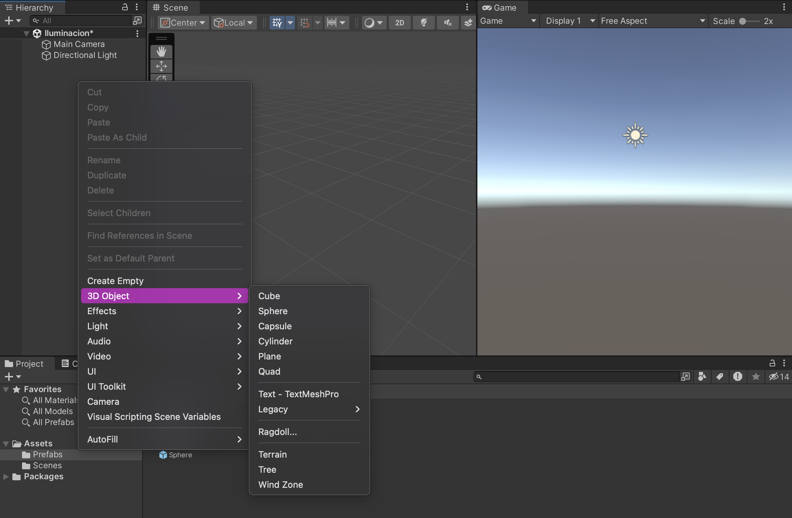
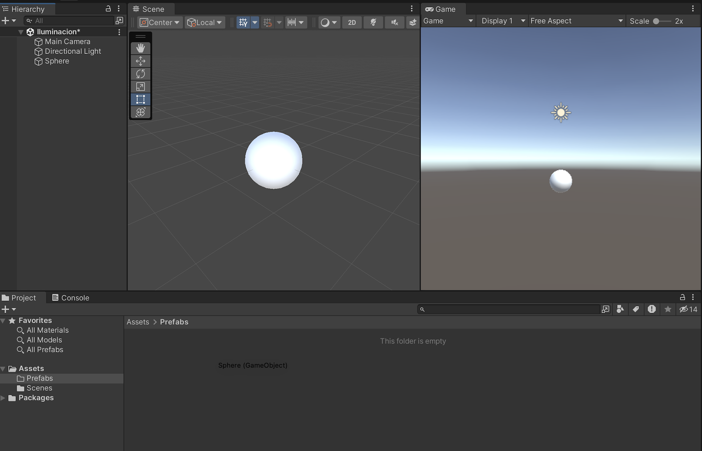
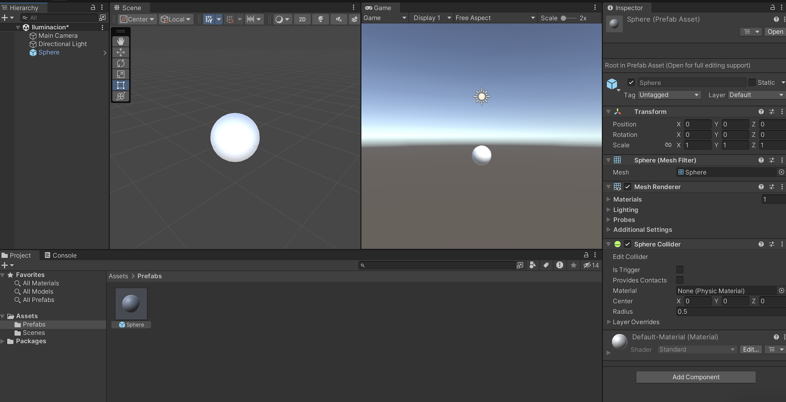

# Iniciar Proyecto 3D

`Unity Editor` que es donde insertas y manipulas los objetos de una escena.

`Unity Hub` es donde accesas a los diferentes proyectos y donde creas los nuevos. (es necesario para usar Unity)

Para los siguientes ejemplos se usara el template de 3D, en muchos otros casos se usa **3D (URP)** que es 3D con Universal Render Pipeline.

## Interfaz Unity

### Ventanas

Las ventanas principales dentro del Unity Editor son:

- `Scene`
  - Es donde se agregan los diferentes objetos y donde se puede interactuar con ellos para acomodarlos.
- `Game`
  - Es la imagen de lo que se ve cuando se inicia el juego/experiencia/animación/etc
- `Hierarchy`
  - Donde podemos ver y reorganizar los objetos de la **escena**
- `Project`
  - Tenemos el folder de assets que es donde vamos a tener los archivos (scripts, escenas, prefabs, modelos, materiales, etc) que vamos a usar en el proyecto. Recomiendo que cada tipo de archivo tenga su propia carpeta
- `Inspector`
  - Al seleccionar un objeto de la ventana de hierarchy, en la ventana de inspector vamos a poder ver las propiedades y detalles de dicho objeto

Recomiendo poner la `Game view` a lado de la `Scene view` para observar los cambios de la escena.

### Movimiento en escena

- Manita (click izquierdo)

Te mueves a lo largo y alto del espacio

- Click derecho

Cambia el ángulo de visión usando como pivote la posición de la cámara

Al mismo tiempo se pueden usar las teclas `wasdeq` para moverse en el espacio usando como anclaje el cursor.

- w : hacia delante
- s : hacia atrás
- a: hacia la izquierda
- d : hacia la derecha
- q : hacia abajo
- e : hacia arriba

- Movimiento objeto

Al seleccionar un objeto y el simbolo de plano coordenado se puede mover manualmente el objeto.

- Rect Tool

Sirve para cambiar las dimensiones del objeto (alto, ancho, largo)
También se pueden cambiar desde la ventana de `Inspector` (importante que esté seleccionado el objeto en la ventana de `hierarchy`)

- Rotacion

Para girar el objeto entorno a un eje en concreto (también se puede realizar desde la inspector window)

## Objetos

Para agregar un objeto a la escena hay que posicionarse en la ventana de Hierachy (una vez seleccionada la escena a la que se quiere agregar) y darle click derecho y elegir el objeto deseado
.

Si no se quiere una de las formas default pero más bien un modelo importado el proceso es similar, hay que arrastar el modelo a la ventana de hierarchy.

### Prefabs

Un prefab en Unity (prefabricated object) es una plantilla de un objeto un conjunto de objetos que se puede usar múltiples veces en una escena o en diferentes escenas.

Sirve mucho para cuando tienes múltiples instancias del mismo objeto en una escena, de esta forma cada vez que tengas que cambiar el objeto, en vez de ir cambiando todos los objetos uno a uno, cambias el prefab una vez y en la escena tienes múltiples instancias del prefab.

Cualquier cambio que se haga al prefab se aplica automáticamente a todas sus instancia.

Para crear un prefab hay que seleccionar el objeto en la ventana de hierarchy y arrastrarlo al folder previamente creado de prefabs dentro de assets.

