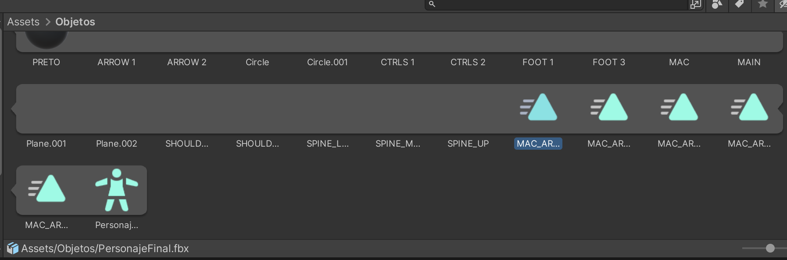

# Movimiento Personaje

Se usara como ejemplo el proyecto de [SaltoObstaculos](SaltoObstaculos/README.md)

## Modelo

Se necesita un archivo `.fbx` que cuente con animaciones

 
 

En la ventana de `inspector` del personaje se agrega un componente de `animator` y dentro de esto se conectan la animaciones del modelo.

 

