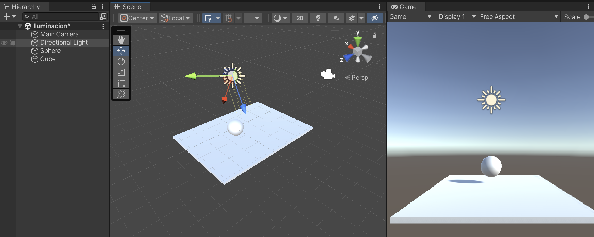

# Objetos

## Materiales

Para agregar materiales a la escena primero hay que crearlos y luego ponerselos a algún objeto.

 

Para que un objeto "tenga" el material definido basta con arrastrar el material al objeto deseado.

**Albedo:** Color principal del material, aquí se le puede asignar alguna textura en vez de un color sólido. **Se mezcla lo que pongamos como textura y como color.**

**Metalic:** Entre más elevemos el atributo de `smoothness` la reflexión va a ser más especular. (Menor smoothnes --> mayor reflexión difusa)
 

**Normal Map:** Se usan para simular detalles de la superficie de una textura.

**Tilling:** Permite alterar el tamaño de la textura, nos ayuda a acomodar la tectura en nuestro objeto

**Emission:** Vuelve al material en "una luz".

### Cambiar color

### Patrones / Texturas

Como con los otros tipos de archivos, se recomienda tener todas las texturas en un mismo folder.

#### Metálico

### Transparencia

### Shaders en Unity?

## Gravedad

## Forma

### Polígonos Regulares

### Polígonos Irregulares

Incluir objetos más complejos que una esfera o cubo (ej. cómo hacer una piramide, poligonos irregulares)

## Movimientos

### Traslación

### Rotación

### Escalación

### Aceleración

## Animación

### De marcos

Update() es por marcos no?

### De tiempo

# Iluminación

Tenemso varias opciones por default en cuanto a iluminación, las podemos agregar a la escena con click derecho sobre la ventana de hierarchy.

La luz que elijamos sigue siendo un objeto entonces se puede tratar como cualquier otro (se pueden crear [prefabs](../InicioProyecto.md#prefabs))

Para mejores efectos dejar el `mode` de la luz como `mixed`.

## Reflectores

Desde el inspector se pueden alterar las características de las sombras que provoca la luz, el rango, color y otras propiedades de la luz.

Podemos definir en el inspector qué `layers`(capas) va a afectar la luz, si hay objetos en otras capas entonces no se verían afectados. Esto se hace en el inspector de la luz, en el atributo de `Culling Mask`.

### Direccionales

Afecta al "mundo" (todos los objetos puestos dentro de la escena) desde una dirección en específico.

Cuando iniciamos un projecto 3D en Unity se nos agrega en automático una `directional light` que tiene un gizmo de sol.

### Omnidireccionales (Puntual)

Ilumina al mundo en un punto en particular

### Luz ambiente

### Ray tracing

# Cámara

Para cambiar el color del fondo se puede hacer desde la cámara (otra opción seria construir un tipo de cuarto alrededor de los objetos)

# Interfaz gráfica

Consultar esta [guía](../InterfazDeUsuario.md).
