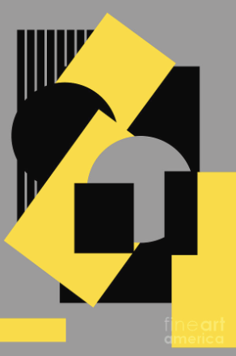

# Proyecto Integral Unity 1

La idea es usar esta imagen como referencia para crear un proyecto en Unity que utilice múltiples términos esenciales en _gráficas por computadoras_.

## El proyecto

El proyecto partirá de un storyboard donde se cuente una historia de tal forma que cuando inicie el proyecto la vista esté vacía y poco a poco entren figuras con el objetivo de que se forme la imagen anterior.

[Storyboard: (Rough Draft)](ProyectoIntegralUnity1Stroyboard/exports/ProyectoIntegralUnity1Stroyboard.gif) Si se abre el proyecto de Storyboarder se pueden observar los comentarios de las escenas.

### Requisitos

- Mínimo un objeto:

  - entra a la escena por el eje:
    - y
    - x
    - z
  - rota
  - rebota
  - desaparezca

- Deben de haber reflectores x & y.
  - Se deben de poder mover en la escena
- Los movimientos de los objetos ocurren con al menos 2 velocidades distintas
- Texturas:
  - Mínimo 1 objeto con textura mate (que no sea un color sólido)
  - Mínimo 1 objeto con textura metálica

## Conceptos implementados

## Herramientas adicionales

Para el storyboard Wonderunit tiene [Storyboarder](https://wonderunit.com/storyboarder/faq/#How-do-I-get-started) que es un software para crear y acomodar storyboard en 2 y 3D.
