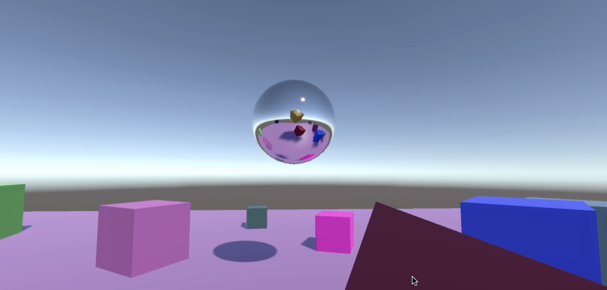
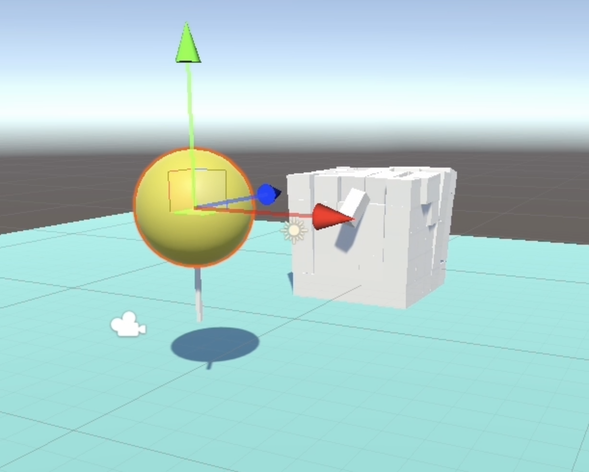
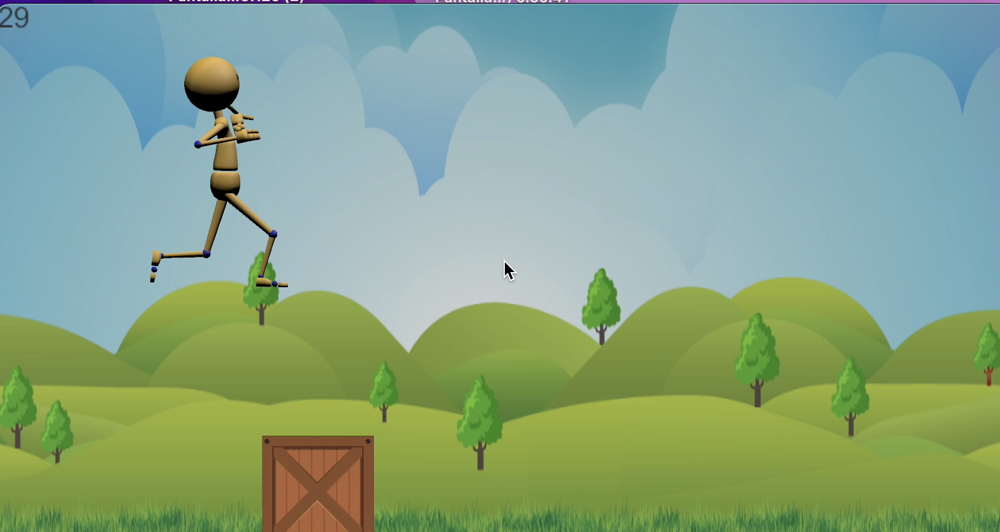

# Intro a Unity

## Intro a interfaces gráficas

Un manual sobre los componentes básicos y más usados de una interfaz gráfica.

[Explicacion GUI](InterfazDeUsuario.md)

## Estructura Repositorio

### Explosión Objetos

[ReadMe Proyecto](ExplosionCubos/README.md)

### Colisión Objetos

[ReadMe Proyecto](ColisionObjetos/README.md)

### Salto Obstáculos

[ReadMe Proyecto](SaltoObstaculos/README.md)

Se mueve el fondo en loop (en eje x) y van entrando objetos (cajas) al marco y desaparecen cuando llegan a una cierta posición en x. El personaje se queda en la misma posición de x pero cuando se una la `space bar` se eleva en eje y simulando un salto, se utilizan animaciones del personaje para que el movimiento sea más suave.

Para más información sobre como utilizar las animaciones de un modelo consultar [este archivo](MovimientoPersonaje.md).

## Realidad Aumentada

[Repositorio con proyectos de AR](https://github.com/marielsgtzz/RealidadAumentada/tree/main)

#### Referencias

https://www.udemy.com/course/unity-curso-completo-profesional-de-programacion-desde-cero/
